

<!-- Custom animated header (assets/header.svg): DNA helix, shimmering name, typed tagline -->

  

  
  
  

  



## `whoami` 👋

Hey, I'm **Sanchit** — a **B.Sc. Life Sciences student at Sri Aurobindo College, University of Delhi**, building projects at the intersection of data, software, and biology.

I enjoy taking a problem from raw data to a working result: cleaning datasets, exploring patterns, building predictive models, forecasting demand, and turning analysis into dashboards or small web apps.

### 🎛️ My current portfolio mix

  

  

## 🚀 Featured Projects

<!-- Each card is an animated SVG in /assets. Click a card to open the project. -->

<table>
<tr>
<td width="50%" align="center">
  <a href="https://nyc-room-type-predictor-gpjz.onrender.com/"></a>
</td>
<td width="50%" align="center">
  <a href="https://type2diabetes-digitaltwin.streamlit.app/"></a>
</td>
</tr>
<tr>
<td width="50%" align="center">
  
</td>
<td width="50%" align="center">
  <a href="https://pathfinder-forge-drab.vercel.app/"></a>
</td>
</tr>
<tr>
<td width="50%" align="center">
  <a href="https://datalens-insights.lovable.app/"></a>
</td>
<td width="50%" align="center">
  <a href="https://docklens-bioedge.streamlit.app/"></a>
</td>
</tr>
</table>

### 🧫 More work from my project lab

| Project | What it explores | Link |
|---|---|---|
| 🧬 **BioEdge India** | AI tools, learning resources, and career support for life-sciences learners | [Open site](https://bioedgeindia.vercel.app/) |
| 🔬 **GeneScope Web** | DNA sequence utilities, ORF detection, alignment, GC content, and primer-related analysis | [Open app](https://dna-sequence-analyzer-gamma.vercel.app/) |
| 👥 **HR Attrition Analytics** | HR KPIs and attrition analysis using Microsoft Fabric and Power BI, including security concepts | Project details available in my GitHub repositories |
| 📰 **Neural Feed** | React-based AI-news aggregator prototype | Project in progress |

## 🧰 Toolkit

  

**Data Science & Machine Learning** 

**Data Analytics & Business Intelligence** 

**Life Sciences & Computational Biology** 

## 📊 GitHub at a glance

  
  
    
  

### 🐍 Contribution snake

<picture>
  <source media="(prefers-color-scheme: dark)" srcset="https://raw.githubusercontent.com/SanchitKRai/SanchitKRai/output/github-contribution-grid-snake-dark.svg" />
  
</picture>

### 🏆 Trophies & Achievements

  
    
  
Building projects, learning new skills, and improving through consistent practice. 🚀

  

## 🌱 What I'm working toward

- Building stronger foundations in statistics, model evaluation, and feature engineering.
- Shipping end-to-end projects that include reproducible analysis, clear documentation, and usable interfaces.
- Connecting analytics and ML with healthcare and life-sciences problems—without overstating what a prototype can prove.

### `DATA → MODELS → INSIGHTS → IMPACT`

Built with curiosity, caffeine, and a commitment to keep learning. ✨

